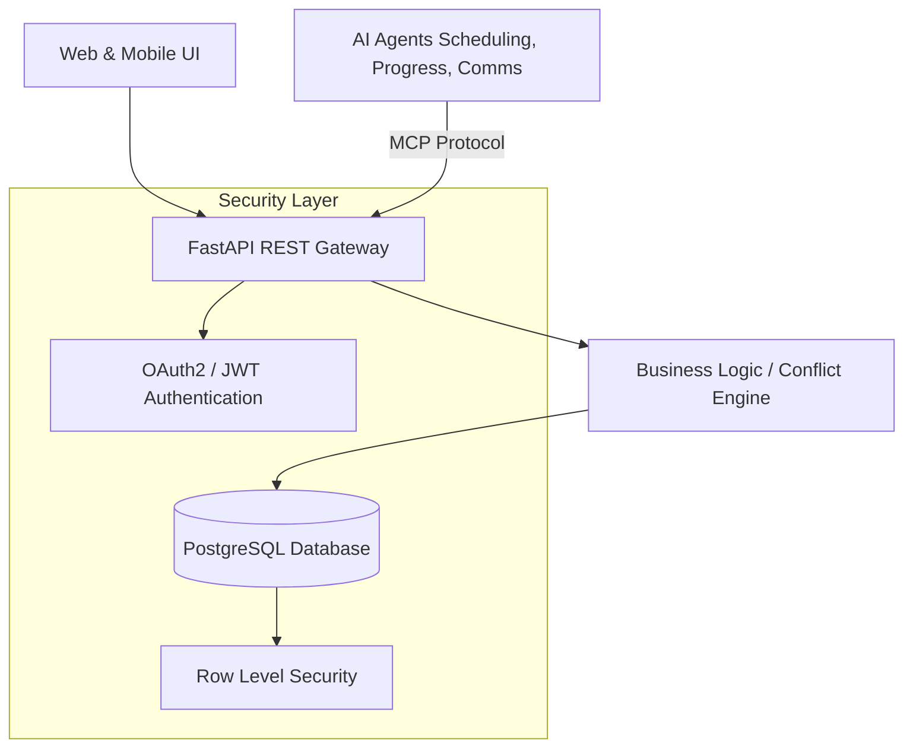

# Architecture Blueprint: Music Teacher Management System

This blueprint details the architectural specifications, agentic tool contracts, database schemas, and client design patterns for a modern, private music teacher booking and management platform. It is engineered with an **agent-first architecture**, facilitating safe, automated operations via AI agents while maintaining absolute compliance with children's privacy regulations (COPPA).

---

## 1. System Architecture

The application implements a layered architecture separating core concerns into clean boundaries:



### Key Components:
- **API Gateway (FastAPI):** Exposes both REST endpoints for clients and Model Context Protocol (MCP) entrypoints for agentic systems.
- **Conflict Resolution Engine:** A standalone, algorithmic Python library that calculates event intervals, processes RFC 5545 Recurrence Rules (`RRULE`), detects overlaps, and runs density optimization models for slot recommendations.
- **PostgreSQL Database:** Acts as the single source of truth, enforcing relational integrity constraints and child-parent relationship links.
- **Row-Level Security (RLS) Engine:** Enforces data isolation rules directly at the DBMS level, guaranteeing that even compromised API layers or rogue queries from sub-agents cannot bypass student privacy protections.

---

## 2. Database Schema Design (COPPA Compliance)

The Children's Online Privacy Protection Act (COPPA) mandates strict guidelines for data handling of children under 13:
1. **Parental Control:** Parents must have control over what information is collected from their child.
2. **Linked Accounts:** Student profiles for children under 13 must be linked to a verified parent account, which manages permissions.
3. **Data Minimization:** No unnecessary personal details should be stored for minor students.

### Row-Level Security (RLS) Strategy
We implement Postgres RLS policies based on three roles: `teacher`, `parent`, and `student`.
- **Teachers** can read/write lessons, logs, and progress reports for all students they teach.
- **Parents** can read/write data only for their linked children (students) and themselves.
- **Students** can read their own profiles, lessons, practice logs, and progress reports, but cannot access other students' information or write to teacher-specific columns (like grade values or private notes).

---

## 3. Agentic Component Specifications (MCP Tools & Resources)

To allow autonomous agents (Scheduling Agent, Progress Agent, Communication Agent, Practice Agent) to safely interact with the application, the system exposes **Model Context Protocol (MCP)** schemas. These are modeled as structured tool and resource endpoints.

### 3.1. Scheduling Agent Tools
Enables agents to manage the teacher's schedule, resolve conflicts, and maximize booking density.

- **`query_calendar_availability`**
  - *Description:* Retrieves the teacher's scheduled lessons and general availability windows for a given date range.
  - *Parameters:* `start_date` (ISO string), `end_date` (ISO string)
- **`analyze_booking_density`**
  - *Description:* Evaluates the current schedule density. Helps agents place new lessons directly adjacent to existing ones to minimize fragmented "gap hours" for the teacher.
  - *Parameters:* `date` (ISO string)
- **`resolve_schedule_conflicts`**
  - *Description:* Scans the schedule for overlapping bookings and outputs options for shifting lessons based on teacher and student availability.
  - *Parameters:* `conflict_lesson_id` (UUID), `preferred_time_range` (object)

### 3.2. Progress Analysis Agent Resources
Exposes read-only streams of student activity, logs, and teacher feedback, enabling the agent to synthesize summaries.

- **`resource://students/{student_id}/history`**
  - *Description:* Stream of past lessons, completed scales/songs, practice duration logs, and comments.
- **`resource://repertoire/catalog`**
  - *Description:* Complete catalog of songs, scale lists, drills, and standard skill progression metrics.

### 3.3. Communication Agent (Sandboxed Approvals)
AI-driven communication is a major vector for errors. To prevent agents from spamming parents or sending incorrect lesson changes, all communication actions are **sandboxed**.

- **`stage_communication_draft`**
  - *Description:* Creates a pending notification (email/text) in the database with status `PENDING_TEACHER_APPROVAL`.
  - *Parameters:* `student_id` (UUID), `message_type` (cancellation, reminder, progress), `channel` (email, sms), `subject` (string), `body` (string)
- *Approval Lifecycle:* Drafts must be approved via the teacher's dashboard before dispatching. The agent cannot bypass this sandbox.

### 3.4. Practice Recommendation Agent Tools
Queries the repertoire catalog and links it to student skill levels to draft personalized daily practice plans.

- **`get_recommended_drills`**
  - *Description:* Maps a student's current level (e.g., Beginner, Intermediate, Advanced) and instrument type to a curriculum template.
  - *Parameters:* `skill_level` (string), `instrument` (string)

---

## 4. UI/UX Design Strategy & Guardrails

Music lessons involve three primary user types, each requiring distinct interaction patterns:

```
                  ┌──────────────────────────────────────────┐
                  │          Music Teacher App UI            │
                  └─────────────────────┬────────────────────┘
                                        │
         ┌──────────────────────────────┼──────────────────────────────┐
         ▼                              ▼                              ▼
  Teacher Dashboard             Parent Portal                   Student Portal
  (Heavy Scheduling & Notes)    (Billing, Comms, Booking)       (Gamified, Drills, Logs)
  - Full desktop grid           - Single-tap cancellations      - Giant buttons
  - Bulk note taking            - Clear billing statements      - Visual streak counters
  - Density optimizer display   - Minor account management      - Easy "Log Practice"
```

### 4.1. Teacher Dashboard (Desktop-Optimized Web)
- **Visual Grid:** Drag-and-drop calendar showing overlapping slots in high-contrast red.
- **Bulk Notes:** Quick-add interfaces using keyboard shortcuts so teachers can write feedback in the 2-minute gap between lessons.
- **Density Overlays:** Shows suggested gaps in green (slots directly preceding/succeeding existing bookings) to nudge manual schedulers towards dense booking patterns.

### 4.2. Parent Portal (Responsive Web / Mobile)
- **Extreme Simplicity:** Minimize billing page clutter. Clear displays of "Next Lesson" and "Amount Due."
- **One-Tap Workflows:** Double-tap cancellation with immediate notification of late-cancel policy rules (e.g., if under 24 hours).
- **Consolidated Notification Control:** Allows parent accounts to see all communication logs and approve logins for their children under 13.

### 4.3. Student Portal (Mobile-First / Kids App)
- **High-contrast, Large touch targets:** Designed for tablet stands on pianos.
- **Visual Progress:** Sound-wave or progress ring visualizations for scales and pieces instead of dry databases.
- **Quick-start Timer:** Single-button start/stop for practice session timing.
- **COPPA Guardrails:** No social features, chats, or profile pictures visible to other users. No external sharing.
